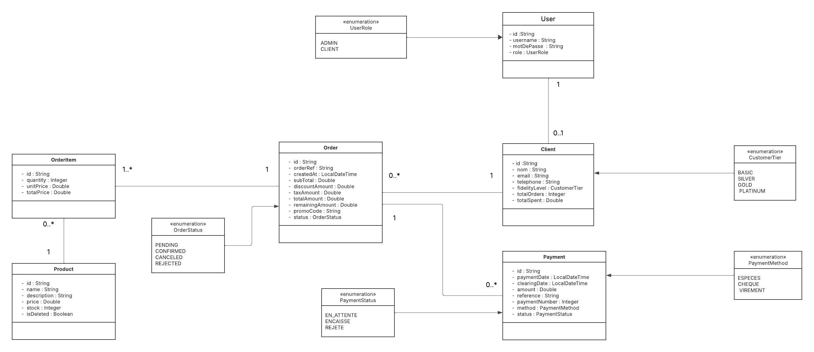
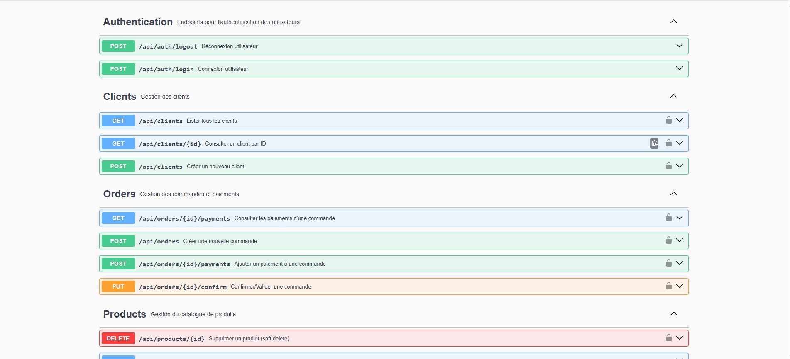

# 🛒 SmartShop - Système de Gestion Commerciale B2B


## 📋 Table des matières

- [Présentation](#-présentation)
- [Contexte du projet](#-contexte-du-projet)
- [Fonctionnalités principales](#-fonctionnalités-principales)
- [Architecture technique](#-architecture-technique)
- [Modèle de données](#-modèle-de-données)
- [Installation et configuration](#-installation-et-configuration)
- [Utilisation de l'API](#-utilisation-de-lapi)
- [Règles métier](#-règles-métier)
- [Tests](#-tests)
- [Documentation API](#-documentation-api)

---

## 🎯 Présentation

**SmartShop** est une application web backend REST de gestion commerciale développée pour **MicroTech Maroc**, un distributeur B2B de matériel informatique basé à Casablanca. Cette solution permet de gérer efficacement un portefeuille de 650 clients actifs avec un système de fidélité intelligent et des paiements fractionnés multi-moyens.

### Caractéristiques clés

✅ **Backend REST API uniquement** (pas d'interface graphique)  
✅ **Authentification par session HTTP** (sans JWT ni Spring Security)  
✅ **Système de fidélité automatique** avec remises progressives  
✅ **Paiements fractionnés** multi-moyens (Espèces, Chèque, Virement)  
✅ **Gestion complète du stock** avec validation en temps réel  
✅ **Traçabilité financière** via historique immuable  
✅ **Architecture en couches** (Controller-Service-Repository-DTO-Mapper)

---

## 🏢 Contexte du projet

MicroTech Maroc souhaite moderniser sa gestion commerciale avec une solution qui permet :

- La gestion de **650 clients actifs** avec un système de fidélité personnalisé
- Des **remises progressives** basées sur l'historique d'achat (BASIC → SILVER → GOLD → PLATINUM)
- Des **paiements fractionnés** en plusieurs fois et avec différents moyens de paiement
- Une **traçabilité complète** de tous les événements financiers
- Une **optimisation de la trésorerie** avec suivi des encaissements différés

---

## 🚀 Fonctionnalités principales

### 1. Gestion des utilisateurs et authentification

- **Authentification par session HTTP** (login/logout)
- **Deux rôles distincts :**
  - `ADMIN` : Employés MicroTech (gestion complète)
  - `CLIENT` : Entreprises clientes (consultation uniquement)
- **Contrôle d'accès basé sur les rôles**

### 2. Gestion des clients

- ✅ Création, consultation, modification des profils clients
- ✅ Suivi automatique des statistiques :
  - Nombre total de commandes
  - Montant cumulé des commandes confirmées
  - Date de première et dernière commande
- ✅ Consultation de l'historique complet des commandes
- ✅ Calcul automatique du niveau de fidélité

### 3. Système de fidélité automatique

Le niveau de fidélité est calculé automatiquement selon l'historique du client :

| Niveau | Conditions d'obtention | Remise accordée | Seuil d'application |
|--------|------------------------|-----------------|---------------------|
| **BASIC** | Client par défaut | 0% | - |
| **SILVER** | 3 commandes OU 1 000 DH cumulés | 5% | Commande ≥ 500 DH |
| **GOLD** | 10 commandes OU 5 000 DH cumulés | 10% | Commande ≥ 800 DH |
| **PLATINUM** | 20 commandes OU 15 000 DH cumulés | 15% | Commande ≥ 1 200 DH |

**Exemple concret :**

```
Client Amine commence avec le niveau BASIC (0 remise)

Commande 1 : 250 DH → BASIC → Pas de remise
Commande 2 : 350 DH → BASIC → Pas de remise  
Commande 3 : 450 DH → BASIC → Pas de remise
→ Après validation : 3 commandes, 1 050 DH → DEVIENT SILVER

Commande 4 : 600 DH → SILVER → Remise 5% = -30 DH → Prix final : 570 DH
Commande 5 : 3 500 DH → SILVER → Remise 5% = -175 DH → Prix final : 3 325 DH
→ Après validation : 5 commandes, 5 150 DH → DEVIENT GOLD

Commande 6 : 900 DH → GOLD → Remise 10% = -90 DH → Prix final : 810 DH
```

### 4. Gestion des produits

- ✅ CRUD complet (Create, Read, Update, Delete)
- ✅ Gestion du stock avec validation automatique
- ✅ Soft delete si le produit est lié à des commandes
- ✅ Filtres et pagination pour la liste des produits

### 5. Gestion des commandes

- ✅ Création de commandes multi-produits avec quantités
- ✅ Validation automatique du stock disponible
- ✅ Calcul automatique des montants :
  - Sous-total HT
  - Remise fidélité + Code promo (cumulatifs)
  - TVA 20% (configurable) calculée après remise
  - Total TTC
- ✅ Gestion des statuts :
  - `PENDING` : En attente de validation
  - `CONFIRMED` : Validée par l'ADMIN (après paiement complet)
  - `CANCELED` : Annulée manuellement
  - `REJECTED` : Refusée (stock insuffisant)

**Formule de calcul :**

```
Sous-total HT = Σ (Prix unitaire × Quantité)
Remise totale = Remise fidélité + Remise code promo
Montant HT après remise = Sous-total HT - Remise totale
TVA = Montant HT après remise × 20%
Total TTC = Montant HT après remise + TVA
```

### 6. Système de paiements multi-moyens

**Trois moyens de paiement acceptés :**

| Moyen | Caractéristiques | Statuts |
|-------|------------------|---------|
| **ESPECES** | Limite légale : 20 000 DH max par paiement<br>Paiement immédiat | `ENCAISSÉ` |
| **CHEQUE** | Paiement différé avec date d'échéance<br>Nécessite : numéro, banque, échéance | `EN_ATTENTE` → `ENCAISSÉ` / `REJETÉ` |
| **VIREMENT** | Paiement immédiat ou différé<br>Nécessite : référence, banque | `ENCAISSÉ` |

**Paiement fractionné :**

Une commande peut être payée en plusieurs fois avec différents moyens de paiement.

**⚠️ Règle importante :** Une commande ne peut être validée (`CONFIRMED`) que si le montant restant est égal à 0 DH.

**Exemple de paiement fractionné :**

```
Commande de 10 000 DH

Paiement 1 (05/11/2025) : 6 000 DH en ESPECES → Restant : 4 000 DH
Paiement 2 (08/11/2025) : 3 000 DH par CHEQUE → Restant : 1 000 DH
Paiement 3 (12/11/2025) : 1 000 DH par VIREMENT → Restant : 0 DH
→ Commande peut être validée par ADMIN → CONFIRMED
```

---

## 🏗️ Architecture technique

### Stack technologique

| Catégorie | Technologie | Version |
|-----------|-------------|---------|
| **Backend** | Spring Boot | 3.5.8 |
| **Langage** | Java | 17 |
| **Base de données** | PostgreSQL | Latest |
| **ORM** | Spring Data JPA / Hibernate | - |
| **Migration DB** | Liquibase | - |
| **Mapping** | MapStruct | 1.5.5.Final |
| **Validation** | Spring Validation | - |
| **Documentation API** | Springdoc OpenAPI (Swagger) | 2.7.0 |
| **Tests** | JUnit 5, Mockito, H2 | - |
| **Build** | Maven | - |

### Architecture en couches

```
┌─────────────────────────────────────────┐
│         Controller Layer                │  ← Endpoints REST
│  (AuthController, ClientController...)  │
└─────────────────────────────────────────┘
                  ↓
┌─────────────────────────────────────────┐
│          Service Layer                  │  ← Logique métier
│  (ClientService, OrderService...)       │
└─────────────────────────────────────────┘
                  ↓
┌─────────────────────────────────────────┐
│        Repository Layer                 │  ← Accès aux données
│  (ClientRepository, OrderRepository...) │
└─────────────────────────────────────────┘
                  ↓
┌─────────────────────────────────────────┐
│          Database (PostgreSQL)          │
└─────────────────────────────────────────┘
```

**Composants transversaux :**

- **DTO (Data Transfer Objects)** : Objets de transfert entre les couches
- **Mapper (MapStruct)** : Conversion automatique Entities ↔ DTOs
- **Exception Handler** : Gestion centralisée des erreurs avec `@ControllerAdvice`
- **Interceptor** : Gestion de l'authentification avec `AuthInterceptor`
- **Config** : Configuration OpenAPI et Web

### Principes de développement

✅ **Clean Code** : Code lisible et maintenable  
✅ **SOLID Principles** : Architecture orientée objet  
✅ **DRY (Don't Repeat Yourself)** : Éviter la duplication de code  
✅ **Interface-based design** : Utilisation d'interfaces pour la flexibilité  
✅ **Builder Pattern** : Construction d'objets complexes avec Lombok  
✅ **Stream API & Lambda** : Programmation fonctionnelle Java 8+  
✅ **Java Time API** : Gestion moderne des dates

---

## 📊 Modèle de données

### Diagramme de classes



### Entités principales

#### 1. **User** (Utilisateur)
```java
- id : String (UUID)
- username : String (unique)
- motDePasse : String
- role : UserRole (ADMIN, CLIENT)
```

#### 2. **Client**
```java
- id : String (UUID)
- nom : String
- email : String (unique)
- telephone : String
- fidelityLevel : CustomerTier (BASIC, SILVER, GOLD, PLATINUM)
- totalOrders : Integer (calculé automatiquement)
- totalSpent : BigDecimal (calculé automatiquement)
- user : User (OneToOne)
```

#### 3. **Product** (Produit)
```java
- id : String (UUID)
- name : String
- description : String
- price : BigDecimal
- stock : Integer
- isDeleted : Boolean (soft delete)
```

#### 4. **Order** (Commande)
```java
- id : String (UUID)
- orderRef : String (référence unique)
- createdAt : LocalDateTime
- subTotal : BigDecimal (sous-total HT)
- discountAmount : BigDecimal (montant remise)
- taxAmount : BigDecimal (montant TVA)
- totalAmount : BigDecimal (total TTC)
- remainingAmount : BigDecimal (montant restant à payer)
- promoCode : String (format: PROMO-XXXX)
- status : OrderStatus (PENDING, CONFIRMED, CANCELED, REJECTED)
- client : Client (ManyToOne)
- items : List<OrderItem> (OneToMany)
- payments : List<Payment> (OneToMany)
```

#### 5. **OrderItem** (Ligne de commande)
```java
- id : String (UUID)
- product : Product (ManyToOne)
- quantity : Integer
- unitPrice : BigDecimal
- lineTotal : BigDecimal
- order : Order (ManyToOne)
```

#### 6. **Payment** (Paiement)
```java
- id : String (UUID)
- paymentDate : LocalDateTime (date de paiement)
- clearingDate : LocalDateTime (date d'encaissement)
- amount : BigDecimal
- reference : String
- paymentNumber : Integer (numéro séquentiel)
- method : PaymentMethod (ESPECES, CHEQUE, VIREMENT)
- status : PaymentStatus (EN_ATTENTE, ENCAISSÉ, REJETÉ)
- order : Order (ManyToOne)
```

### Enums du système

#### **UserRole**
```java
ADMIN    // Employé MicroTech (gestion complète)
CLIENT   // Entreprise cliente (consultation uniquement)
```

#### **CustomerTier**
```java
BASIC      // Pas de remise
SILVER     // 5% si commande ≥ 500 DH
GOLD       // 10% si commande ≥ 800 DH
PLATINUM   // 15% si commande ≥ 1 200 DH
```

#### **OrderStatus**
```java
PENDING    // En attente de validation
CONFIRMED  // Validée par ADMIN (après paiement complet)
CANCELED   // Annulée manuellement
REJECTED   // Refusée (stock insuffisant)
```

#### **PaymentMethod**
```java
ESPECES    // Paiement en espèces (max 20 000 DH)
CHEQUE     // Paiement par chèque (différé)
VIREMENT   // Paiement par virement bancaire
```

#### **PaymentStatus**
```java
EN_ATTENTE  // Paiement reçu mais non encaissé
ENCAISSÉ    // Montant effectivement reçu
REJETÉ      // Paiement rejeté (chèque sans provision)
```

### Relations entre entités

```
User 1 ←→ 1 Client
Client 1 ←→ N Order
Order 1 ←→ N OrderItem
OrderItem N ←→ 1 Product
Order 1 ←→ N Payment
```

---

## 🔧 Installation et configuration

### Prérequis

- ☑️ **Java JDK 17** ou supérieur
- ☑️ **Maven 3.6+**
- ☑️ **PostgreSQL 12+**
- ☑️ **Git**
- ☑️ **Postman** ou **Navigateur** pour tester l'API

### Étapes d'installation

#### 1. Cloner le projet

```bash
git clone https://github.com/HamzaBraik01/microtech-smartshop-rest.git
cd microtech-smartshop-rest
```

#### 2. Créer la base de données PostgreSQL

```sql
CREATE DATABASE smartshop;
```

#### 3. Configurer la base de données

Modifier le fichier `src/main/resources/application.yaml` :

```yaml
spring:
  datasource:
    url: jdbc:postgresql://localhost:5432/smartshop
    username: postgres
    password: VOTRE_MOT_DE_PASSE
    driver-class-name: org.postgresql.Driver
```

#### 4. Construire le projet

```bash
mvn clean install
```

#### 5. Lancer l'application

```bash
mvn spring-boot:run
```

L'application démarre sur **http://localhost:8080**

#### 6. Accéder à la documentation Swagger

Ouvrir dans un navigateur :

```
http://localhost:8080/swagger-ui.html
```

### Configuration Liquibase

Les migrations de base de données sont gérées automatiquement par **Liquibase** au démarrage de l'application.

**Fichiers de migration :**

```
src/main/resources/db/changelog/
├── db.changelog-master.yaml
└── changes/
    ├── 001-create-users-clients.yaml
    ├── 002-create-products-table.yaml
    ├── 003-create-orders-payments.yaml
    └── 004-insert-seed-data.yaml
```

**Données de test** sont automatiquement insérées via `004-insert-seed-data.yaml` :

- **Admin** : `username: admin` / `password: admin123`
- **Client** : `username: techsolutions` / `password: client123`
- **5+ produits** avec stock
- **Plusieurs commandes** de test

---

## 🔐 Utilisation de l'API

### Authentification

L'API utilise une **authentification par session HTTP**. Vous devez d'abord vous connecter pour accéder aux endpoints protégés.

#### **POST /api/auth/login** - Se connecter

**Request Body :**
```json
{
  "username": "admin",
  "password": "admin123"
}
```

**Response (200 OK) :**
```json
{
  "message": "Connexion réussie",
  "userId": "uuid-123",
  "role": "ADMIN"
}
```

**Cookies :** Un cookie de session `JSESSIONID` est automatiquement créé et doit être inclus dans toutes les requêtes suivantes.

#### **POST /api/auth/logout** - Se déconnecter

**Response (200 OK) :**
```json
{
  "message": "Déconnexion réussie"
}
```

### Endpoints principaux

#### 📁 **Gestion des clients**

| Méthode | Endpoint | Description | Rôle requis |
|---------|----------|-------------|-------------|
| `GET` | `/api/clients` | Liste des clients avec pagination | ADMIN |
| `GET` | `/api/clients/{id}` | Détails d'un client | ADMIN |
| `POST` | `/api/clients` | Créer un nouveau client | ADMIN |
| `PUT` | `/api/clients/{id}` | Modifier un client | ADMIN |
| `GET` | `/api/clients/{id}/orders` | Historique des commandes d'un client | ADMIN |

#### 📦 **Gestion des produits**

| Méthode | Endpoint | Description | Rôle requis |
|---------|----------|-------------|-------------|
| `GET` | `/api/products` | Liste des produits avec filtres | ADMIN, CLIENT |
| `GET` | `/api/products/{id}` | Détails d'un produit | ADMIN, CLIENT |
| `POST` | `/api/products` | Créer un produit | ADMIN |
| `PUT` | `/api/products/{id}` | Modifier un produit | ADMIN |
| `DELETE` | `/api/products/{id}` | Supprimer un produit (soft delete) | ADMIN |

#### 🛍️ **Gestion des commandes**

| Méthode | Endpoint | Description | Rôle requis |
|---------|----------|-------------|-------------|
| `GET` | `/api/orders` | Liste des commandes | ADMIN |
| `GET` | `/api/orders/{id}` | Détails d'une commande | ADMIN |
| `POST` | `/api/orders` | Créer une commande | ADMIN |
| `PUT` | `/api/orders/{id}/confirm` | Valider une commande | ADMIN |
| `PUT` | `/api/orders/{id}/cancel` | Annuler une commande | ADMIN |

#### 💳 **Gestion des paiements**

| Méthode | Endpoint | Description | Rôle requis |
|---------|----------|-------------|-------------|
| `POST` | `/api/orders/{orderId}/payments` | Ajouter un paiement à une commande | ADMIN |
| `GET` | `/api/orders/{orderId}/payments` | Liste des paiements d'une commande | ADMIN |

### Exemples de requêtes

#### Créer un client

**POST /api/clients**

```json
{
  "nom": "Entreprise Tech Solutions",
  "email": "contact@techsolutions.ma",
  "telephone": "0612345678",
  "username": "techsolutions",
  "password": "password123"
}
```

#### Créer une commande

**POST /api/orders**

```json
{
  "clientId": "uuid-client-123",
  "promoCode": "PROMO-2024",
  "items": [
    {
      "productId": "uuid-product-1",
      "quantity": 2
    },
    {
      "productId": "uuid-product-2",
      "quantity": 1
    }
  ]
}
```

#### Ajouter un paiement

**POST /api/orders/{orderId}/payments**

```json
{
  "amount": 5000.00,
  "method": "CHEQUE",
  "reference": "CHQ-123456789",
  "bank": "Attijariwafa Bank",
  "dueDate": "2025-12-31"
}
```

---

## 📜 Règles métier

### 1. Validation du stock

✅ La quantité demandée doit être ≤ au stock disponible  
✅ Le stock est automatiquement décrémenté après validation de la commande  
✅ Une commande avec stock insuffisant est automatiquement `REJECTED`

### 2. Calcul automatique du niveau de fidélité

Le niveau est recalculé automatiquement après chaque commande confirmée :

```java
if (totalOrders >= 20 || totalSpent >= 15000) → PLATINUM
else if (totalOrders >= 10 || totalSpent >= 5000) → GOLD
else if (totalOrders >= 3 || totalSpent >= 1000) → SILVER
else → BASIC
```

### 3. Application des remises

**Remise fidélité :**
- Appliquée automatiquement selon le niveau actuel du client
- Uniquement si le sous-total atteint le seuil minimum

**Code promo :**
- Format strict : `PROMO-XXXX` (4 caractères alphanumériques)
- Remise fixe de +5%
- Cumulable avec la remise fidélité

**Calcul final :**
```
Remise totale = Remise fidélité + Remise code promo
```

### 4. Calcul de la TVA

✅ TVA de 20% (configurable)  
✅ **Important :** La TVA se calcule sur le montant APRÈS remise (standard au Maroc)

```
Exemple : 
Sous-total : 1 000 DH
Remise : -100 DH
Montant après remise : 900 DH
TVA (20%) : 900 × 0.20 = 180 DH
Total TTC : 900 + 180 = 1 080 DH
```

### 5. Validation des commandes

Une commande ne peut passer au statut `CONFIRMED` que si :

✅ Le statut actuel est `PENDING`  
✅ Le montant restant est égal à 0 DH (paiement complet)  
✅ Tous les paiements par chèque sont encaissés ou le total des paiements `ENCAISSÉ` couvre le montant total

### 6. Limites de paiement en espèces

⚠️ **Limite légale** : 20 000 DH maximum par paiement en espèces (Article 193 CGI Maroc)

```java
if (method == ESPECES && amount > 20000) {
    throw new BusinessException("Le montant en espèces ne peut pas dépasser 20 000 DH");
}
```

### 7. Gestion des statuts de commande

**Transitions autorisées :**

```
PENDING → CONFIRMED  (si paiement complet)
PENDING → CANCELED   (annulation manuelle ADMIN)
PENDING → REJECTED   (stock insuffisant)

CONFIRMED, CANCELED, REJECTED → Statuts finaux (aucune modification possible)
```

### 8. Arrondis

✅ Tous les montants sont arrondis à **2 décimales**  
✅ Utilisation de `BigDecimal` avec `HALF_UP` rounding

---

## 🧪 Tests

### Tests unitaires

Le projet inclut des tests unitaires avec **JUnit 5** et **Mockito**.

```bash
# Exécuter tous les tests
mvn test

# Exécuter les tests avec rapport de couverture
mvn test jacoco:report
```

**Structure des tests :**

```
src/test/java/com/microtech/smartshop/
├── service/
│   ├── ClientServiceTest.java
│   ├── OrderServiceTest.java
│   ├── ProductServiceTest.java
│   └── PaymentServiceTest.java
└── SmartshopApplicationTests.java
```

**Configuration de test :**

- Base de données : **H2 en mémoire**
- Fichier de configuration : `src/test/resources/application-test.yaml`

### Tests avec Postman

Une collection Postman complète est disponible pour tester tous les endpoints.

**Scénario de test recommandé :**

1. ✅ Login en tant qu'ADMIN
2. ✅ Créer un client
3. ✅ Créer des produits
4. ✅ Créer une commande pour le client
5. ✅ Ajouter des paiements fractionnés
6. ✅ Valider la commande (une fois le paiement complet)
7. ✅ Vérifier la mise à jour du niveau de fidélité
8. ✅ Logout

---

## 📚 Documentation API

### Swagger UI

La documentation interactive de l'API est disponible via **Swagger UI** :

```
http://localhost:8080/swagger-ui.html
```

**Fonctionnalités :**

✅ Documentation complète de tous les endpoints  
✅ Modèles de requêtes/réponses  
✅ Test interactif des endpoints  
✅ Authentification intégrée  
✅ Exemples de données

### OpenAPI Specification

Le fichier OpenAPI JSON est disponible à :

```
http://localhost:8080/api-docs
```

### Comptes de test

**Admin (gestion complète) :**
```
Username : admin
Password : admin123
```

**Client (consultation uniquement) :**
```
Username : techsolutions
Password : client123
```

---

## 🔧 Gestion des erreurs

### Format des réponses d'erreur

Toutes les erreurs sont retournées au format JSON standardisé :

```json
{
  "timestamp": "2025-12-08T10:30:00",
  "status": 404,
  "error": "Not Found",
  "message": "Client avec l'ID xyz introuvable",
  "path": "/api/clients/xyz"
}
```

### Codes HTTP utilisés

| Code | Type | Signification |
|------|------|---------------|
| `200` | Success | Requête réussie |
| `201` | Success | Ressource créée |
| `400` | Error | Erreur de validation (données invalides) |
| `401` | Error | Non authentifié (session expirée ou absente) |
| `403` | Error | Accès refusé (permissions insuffisantes) |
| `404` | Error | Ressource introuvable |
| `422` | Error | Règle métier violée (stock insuffisant, commande déjà validée, etc.) |
| `500` | Error | Erreur interne du serveur |

### Gestion centralisée avec @ControllerAdvice

Toutes les exceptions sont gérées de manière centralisée via `GlobalExceptionHandler` :

```java
@ControllerAdvice
public class GlobalExceptionHandler {
    @ExceptionHandler(ResourceNotFoundException.class)
    public ResponseEntity<ErrorResponse> handleNotFound(...) { ... }
    
    @ExceptionHandler(BusinessException.class)
    public ResponseEntity<ErrorResponse> handleBusinessException(...) { ... }
    
    @ExceptionHandler(ValidationException.class)
    public ResponseEntity<ErrorResponse> handleValidation(...) { ... }
}
```

---

## 📁 Structure du projet

```
smartshop/
├── docs/
│   ├── diagramme_de_classes.png
│   └── diagramme_de_classes.pdf
├── src/
│   ├── main/
│   │   ├── java/com/microtech/smartshop/
│   │   │   ├── config/               # Configuration (OpenAPI, Web, Interceptor)
│   │   │   ├── controller/           # Endpoints REST
│   │   │   ├── dto/                  # Data Transfer Objects
│   │   │   │   ├── request/          # DTOs pour les requêtes
│   │   │   │   └── response/         # DTOs pour les réponses
│   │   │   ├── entity/               # Entités JPA
│   │   │   ├── enums/                # Énumérations
│   │   │   ├── exception/            # Exceptions personnalisées
│   │   │   ├── mapper/               # Mappers MapStruct
│   │   │   ├── repository/           # Repositories Spring Data JPA
│   │   │   ├── service/              # Services (logique métier)
│   │   │   │   └── impl/             # Implémentations des services
│   │   │   ├── util/                 # Classes utilitaires
│   │   │   └── SmartshopApplication.java
│   │   └── resources/
│   │       ├── application.yaml      # Configuration Spring Boot
│   │       └── db/changelog/         # Migrations Liquibase
│   └── test/
│       ├── java/                     # Tests unitaires
│       └── resources/
│           └── application-test.yaml # Configuration de test
├── target/                           # Fichiers compilés (généré)
├── pom.xml                          # Configuration Maven
└── README.md                        # Ce fichier
```

---

## 🚦 Démarrage rapide

### En 5 étapes

```bash
# 1. Cloner le projet
git clone https://github.com/HamzaBraik01/microtech-smartshop-rest.git

# 2. Créer la base de données PostgreSQL
psql -U postgres -c "CREATE DATABASE smartshop;"

# 3. Configurer application.yaml (username/password PostgreSQL)

# 4. Compiler et lancer
cd microtech-smartshop-rest
mvn spring-boot:run

# 5. Ouvrir Swagger
# http://localhost:8080/swagger-ui.html
```

---

## 📦 Dépendances principales

```xml
<!-- Spring Boot Starter Web -->
<dependency>
    <groupId>org.springframework.boot</groupId>
    <artifactId>spring-boot-starter-web</artifactId>
</dependency>

<!-- Spring Boot Starter Data JPA -->
<dependency>
    <groupId>org.springframework.boot</groupId>
    <artifactId>spring-boot-starter-data-jpa</artifactId>
</dependency>

<!-- PostgreSQL Driver -->
<dependency>
    <groupId>org.postgresql</groupId>
    <artifactId>postgresql</artifactId>
</dependency>

<!-- Lombok -->
<dependency>
    <groupId>org.projectlombok</groupId>
    <artifactId>lombok</artifactId>
</dependency>

<!-- MapStruct -->
<dependency>
    <groupId>org.mapstruct</groupId>
    <artifactId>mapstruct</artifactId>
    <version>1.5.5.Final</version>
</dependency>

<!-- Validation -->
<dependency>
    <groupId>org.springframework.boot</groupId>
    <artifactId>spring-boot-starter-validation</artifactId>
</dependency>

<!-- Liquibase -->
<dependency>
    <groupId>org.liquibase</groupId>
    <artifactId>liquibase-core</artifactId>
</dependency>

<!-- Springdoc OpenAPI (Swagger) -->
<dependency>
    <groupId>org.springdoc</groupId>
    <artifactId>springdoc-openapi-starter-webmvc-ui</artifactId>
    <version>2.7.0</version>
</dependency>
```

---

## 🎓 Compétences développées

### Compétences techniques

✅ **C1-N2** : Installation et configuration de l'environnement de travail  
✅ **C3-N2** : Développement de composants métier  
✅ **C4-N2** : Contribution à la gestion d'un projet informatique  
✅ **C6-N2** : Définition de l'architecture logicielle  
✅ **C7-N2** : Conception et mise en place d'une base de données relationnelle  
✅ **C8-N2** : Développement de composants d'accès aux données  
✅ **C9-N2** : Préparation et exécution des plans de tests

### Compétences transversales

✅ **C1-N2** : Planification du travail individuel et en équipe  
✅ **C6-N2** : Présentation du travail réalisé  
✅ **C8-N2** : Interaction professionnelle respectueuse et constructive

---

## 🎯 Roadmap

### Version actuelle : 1.0.0

- ✅ Authentification par session HTTP
- ✅ Gestion complète des clients
- ✅ Système de fidélité automatique
- ✅ Gestion des produits et stock
- ✅ Création et validation de commandes
- ✅ Paiements fractionnés multi-moyens
- ✅ Documentation Swagger complète

### Améliorations futures

- 🔄 Dashboard statistiques temps réel
- 🔄 Export de données (PDF, Excel)
- 🔄 Notifications email automatiques
- 🔄 Intégration avec systèmes de paiement en ligne
- 🔄 Application mobile (Android/iOS)
- 🔄 Rapports analytiques avancés

---

## 📸 Captures d'écran

### Swagger UI


---

## ⚙️ Configuration avancée

### Variables d'environnement

Vous pouvez surcharger la configuration via des variables d'environnement :

```bash
export SPRING_DATASOURCE_URL=jdbc:postgresql://localhost:5432/smartshop
export SPRING_DATASOURCE_USERNAME=postgres
export SPRING_DATASOURCE_PASSWORD=votre_password
```

### Configuration de la TVA

Pour modifier le taux de TVA, éditer `application.yaml` :

```yaml
business:
  tax:
    rate: 0.20  # 20% par défaut
```

### Configuration du seuil de remise fidélité

Les seuils peuvent être configurés dans le service `LoyaltyService` :

```java
public class LoyaltyConfig {
    public static final int SILVER_MIN_ORDERS = 3;
    public static final BigDecimal SILVER_MIN_SPENT = new BigDecimal("1000");
    // ...
}
```


<div align="center">

**Développé avec ❤️ par Hamza**

⭐ **Si ce projet vous a aidé, n'hésitez pas à lui donner une étoile !** ⭐

</div>

